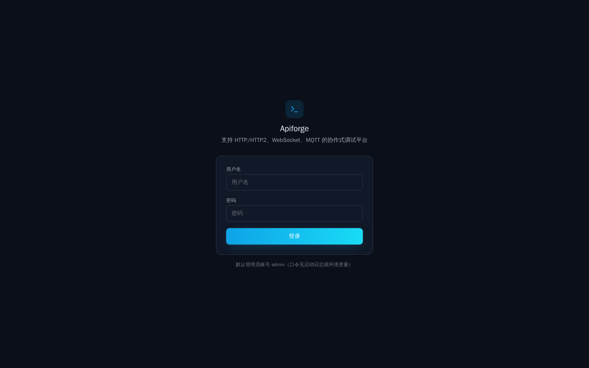

# ApiToolX

> Self-hosted, multi-protocol API client — one Go binary, no cloud lock-in.

[](LICENSE)
[](.github/workflows/ci.yml)

> 📖 Chinese version: [README.zh-CN.md](README.zh-CN.md)

**ApiToolX** is an open-source API client you run on your own server. A single
Go binary serves the entire Vue 3 web UI, so your requests, tokens and API
keys never leave your infrastructure.

Unlike most API clients, it isn't limited to REST & GraphQL — it also speaks
**MQTT, Socket.IO, gRPC and raw TCP / UDP**, which makes it usable for IoT and
message-broker debugging. Teams get per-project roles and permissions; everyone
gets saved collections, dark mode and a Chinese / English interface.

## Why ApiToolX

- **Self-hosted & single-binary** — no account, no telemetry, no vendor cloud.
- **Multi-protocol in one tool** — HTTP / HTTP2, WebSocket, MQTT, Socket.IO,
  GraphQL, gRPC, and TCP / UDP relay.
- **Team-ready** — system `admin` and project `owner` / `maintainer` / `developer`
  with fine-grained `add` / `edit` / `delete` permissions.
- **Bilingual & themed** — dark / light and 中文 / English, persisted locally.
- **Portable storage** — SQLite by default, switch to PostgreSQL / MySQL anytime.

Planned: MCP and AI / LLM endpoint debugging.

## Screenshot



## Tech stack

| Layer    | Choice                                            |
| -------- | ------------------------------------------------- |
| Backend  | Go · GORM · JWT · static file hosting            |
| Frontend | Vue 3 · Vite · Pinia · Tailwind CSS · vue-i18n    |
| Database | SQLite (default) · PostgreSQL · MySQL            |

## Quick start

### Backend

```bash
cd backend
go run ./cmd/server
```

Listens on `:8080` by default. On first launch an admin is seeded with
`admin / admin123`. In production it serves the built frontend from
`frontend/dist`.

### Frontend (development)

```bash
cd frontend
npm install
npm run dev        # http://localhost:5173, proxies /api to :8080
```

### Production build

```bash
cd frontend
npm run build      # outputs to ../backend/frontend/dist
cd ../backend
go run ./cmd/server # visit http://localhost:8080
```

## Configuration

`backend/config.yaml` controls the port, JWT expiry, proxy response size limit
and CORS allow-list. Sensitive values can be overridden by environment
variables:

| Env var               | Description                                  |
| --------------------- | -------------------------------------------- |
| `APITOOLX_JWT_SECRET`| JWT signing secret (change in production)    |
| `DB_DRIVER`           | `sqlite` (default) / `pg` / `mysql`          |
| `DB_DSN`              | Database connection string                   |
| `SERVER_PORT`         | Listen port                                  |

Example (switch to PostgreSQL):

```bash
DB_DRIVER=pg DB_DSN="host=localhost user=app dbname=apitoolx sslmode=disable" ./apitoolx
```

## Permission model

- `admin` — full system access.
- Project `owner` — full control within the project (the creator becomes owner
  automatically).
- `maintainer` — can manage collections and requests, but cannot delete the
  project or manage members.
- `developer` — operates according to the `add / edit / delete` permissions
  granted by the owner.

## Roadmap

ApiToolX advances in phases by protocol maturity and collaboration capability.
The table below lists each phase's goals and current status.

| Phase | Goals | Status |
| --- | --- | --- |
| Phase 1 · Core request protocols | HTTP / HTTP2, WebSocket, MQTT | Done |
| Phase 2 · Realtime & messaging protocols | Socket.IO, TCP / UDP relay | Done |
| Phase 3 · Structured & RPC protocols | GraphQL, gRPC | Partial |
| Phase 4 · Collaboration & engineering | Member roles & permissions, request collections, themes & i18n, multi-database | Done |
| Phase 5 · Planned | MCP debugging client, AI / LLM endpoint debugging | Planned |

### Phase 1 · Core request protocols (Done)

Covers the most common request-response and long-lived connection scenarios:

- **HTTP / HTTP2**: request building, params, headers, body, environments and
  auth.
- **WebSocket**: connection management, message exchange and a basic frame log
  (direction, opcode, size).
- **MQTT**: publish / subscribe, QoS and topic management.

### Phase 2 · Realtime & messaging protocols (Done)

- **Socket.IO**: event exchange, namespaces and rooms.
- **TCP / UDP relay**: binary send/receive and encoding over `/ws/relay`.

### Phase 3 · Structured & RPC protocols (Done)

- **GraphQL**: queries, variables and Schema exploration.
- **gRPC**: proto loading, unary and streaming calls.

### Phase 4 · Collaboration & engineering (Done)

- **Member roles & permissions**: system `admin`, project `owner` /
  `maintainer` / `developer` with fine-grained `add / edit / delete`
  permissions.
- **Request collections**: nestable folders and saved requests, organized per
  project.
- **Themes & i18n**: dark / light, Chinese / English, persisted to
  `localStorage`.
- **Multi-database**: SQLite by default, switchable to PostgreSQL / MySQL.

### Phase 5 · Planned

- **MCP debugging**: connect to an MCP Server, invoke tools and resources and
  inspect results.
- **AI / LLM endpoint debugging**: request building, streaming responses and
  debugging for large language models.

### Deployment notes

- **Non-root-path deployment**: the frontend is a SPA. If hosted under a sub-path (e.g.
  `/apitoolx/`), set `base: "/apitoolx/"` in `vite.config.ts` and rebuild with `npm run build`;
  the backend `SpaHandler` static directory and fallback route must match that prefix.
- **Enforce HTTPS in production**: terminate TLS at a reverse proxy (Nginx / Caddy / LB) and set
  `proxy.require_https: true` in `config.yaml` (or `APITOOLX_REQUIRE_HTTPS=true`). Once enabled,
  the relay (`/ws/relay`) handshake is forced over TLS to prevent WebSocket / Socket.IO tokens
  passed via the query string from leaking over an unencrypted channel (L1).
- **Admin credentials**: on first launch you can override the default admin with
  `APITOOLX_ADMIN_USERNAME` / `APITOOLX_ADMIN_PASSWORD` (default username `admin`); when
  `APITOOLX_ADMIN_PASSWORD` is unset a random strong password is generated and warned in the logs
  (no more hardcoded weak password). Regardless of source, the default admin is flagged "must change
  password on first login" and is forced to the reset screen after logging in (H6). Strongly
  recommend setting the password via environment variable at deploy time and changing it
  immediately after the first login.

### Future plans

The following capabilities are planned but not yet implemented:

- **Import / export format expansion**: beyond the current Postman v2.1, add
  OpenAPI / Swagger and Bruno (.bru) import and export to ease migration from
  other tools.
- **GraphQL introspection and docs**: Schema introspection, field
  autocompletion and a documentation browser.
- **More auth methods**: add Digest, AWS Signature V4, OAuth 1.0a and NTLM;
  OAuth 2.0 gains the authorization-code grant with PKCE.
- **WebSocket UX**: auto-reconnect and message history import / export.
- **form-data file upload**: reliable multipart binary file upload.
- **Environment scope expansion**: a global environment scope and
  collection-level auth inheritance.
- **Response comparison**: response diff and "save as example".

## Security audit follow-ups (known tech debt)

Reviewed from `bug.md` (see also `bug_rep.md`). Legend: **✅ Resolved** / **🔵 Still recommended / retained**.

> Of the original 70 items, two batches were already fixed (H1–H4/H7, M1/M3/M4/M6/M7/M9/M10/M11/M12/M14/M16/M17/M18/M19 and frontend M26–M31/M33/L9/L10/L16, etc.). This table lists only the items that remain open.

### Security hardening

| Source | Item | Status | Notes |
| --- | --- | --- | --- |
| H8 | Frontend scripts lack a real sandbox | 🔵 | Mitigated: shadow `window`/`localStorage`/`Function`/`eval` and other dangerous globals + strict mode; full Worker/iframe isolation left as a dedicated task |

### Refactor / maintainability

| Source | Item | Status | Notes |
| --- | --- | --- | --- |
| H9 | 8 protocol views copy-pasted | 🔵 | Still recommended as a separate PR: extract a "protocol registry + `useSavedRequest`" (already extracted `useRequestSaver` for shared save logic) |
| L6 | Monolithic `main.go` | 🔵 | Still recommended as a separate PR: split route DI (currently runs fine) |
| L8 | Frontend `any` abuse | 🔵 | Type-polish item, not a defect, deferred |

### Engineering / deploy docs

| Source | Item | Status | Notes |
| --- | --- | --- | --- |
| M15 | List endpoints lack pagination | ✅ (partial) | Project list is paginated (backend `page`/`perPage` + frontend pager); collection/request list pagination deferred |

## License

ApiToolX is licensed under the [GNU Affero General Public License v3.0](LICENSE).
If you plan to offer ApiToolX as a network service, AGPL requires you to make your
modified source available to users. See [CONTRIBUTING.md](CONTRIBUTING.md) to get
started.
